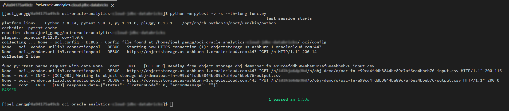
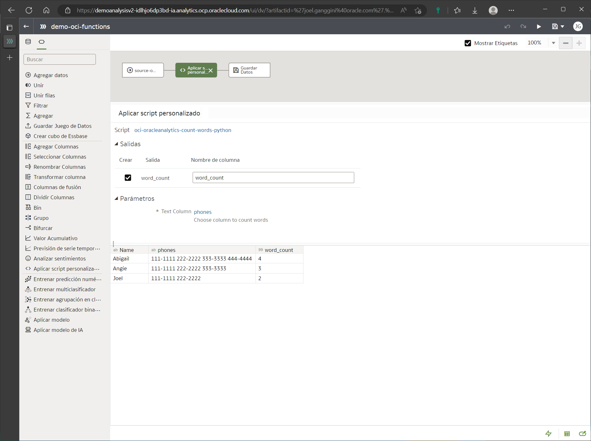

[![Issues][issues-shield]][issues-url]
[![LinkedIn][linkedin-shield]][linkedin-url]


<!-- PROJECT LOGO -->
<br />
<p align="center">
  

  <h2 align="center">OCI Functions</h3>

  <p align="center">
    Integración de Oracle Analytics Cloud y CI Functions
    <br />
    <a href="func.py"><strong>Explore the code »</strong></a>
    <br />
    <br />
    <a href="https://youtu.be/@jganggini">🎬 View Demo</a>
    ·
    <a href="https://github.com/jganggini/oci-functions/issues">Report Bug</a>
    ·
    <a href="https://github.com/jganggini/oci-functions/pulls">Request Feature</a>
  </p>
</p>


<!-- TABLE OF CONTENTS -->
<details open="open">
  <summary>Contenido</summary>
  <ol>
    <li><a href="#caso-de-uso">Caso de Uso</a></li>
    <li>
        <a href="#descripción">Descripción</a>
        <ul>
            <li><a href="#config">Config</a></li>
            <li><a href="#parameters">Parameters</a></li>
        </ul>
    </li>
    <li><a href="#instalación">Instalación</a></li>
    <li><a href="#ejecución-local">Ejecución Local</a></li>
    <li><a href="#Publicación-en-oci">Publicación en OCI</a></li>
    <li><a href="#ejecución-en-oci">Ejecución en OCI</a></li>
    <li><a href="#referencias">Referencias</a></li>
    <li><a href="#contacto">Contacto</a></li>
  </ol>
</details>

<!-- Caso de Uso -->
## Descripción del Ejemplo

El siguiente proyecto complementa el ejemplo expuesto en el siguiente link: [Register and Use Oracle Cloud Infrastructure Functions in Data Flows](https://docs.oracle.com/en/cloud/paas/analytics-cloud/acubi/register-and-use-oci-functions-data-flows.html#GUID-9EF52034-D1BA-4B2C-8378-AE505A4B1009).

<!-- Config -->
## Config

Los SDK y la CLI de Oracle Cloud Infrastructure requieren información de configuración básica, como las credenciales de usuario y el OCID de arrendamiento. [SDK and CLI Configuration File](https://docs.oracle.com/en-us/iaas/Content/API/Concepts/sdkconfig.htm)

<!-- Parameters -->
## Parameters

* <u>Config:</u></br>
  Agregamos los siguientes parámetros de la aplicación:

  ```python
    # [Parameter:utl] Utility
    utl_path                          = str(pathlib.Path(__file__).parent.absolute())
    # [Parameter:oci]
    par_oci_profile_name              = 'OAC' #OAC/CLOUDSHELL
    par_oci_config                    = oci.config.from_file(utl_path + '/_oci/config', par_oci_profile_name)
    # [Parameter:oci_obj]
    par_oci_obj_object_storage_client = oci.object_storage.ObjectStorageClient(par_oci_config)
    par_oci_obj_namespace_name        = par_oci_obj_object_storage_client.get_namespace().data
  ```

  * Descargamos el `API Key` de OCI y lo colocamos en la carpeta `.\_oci\..`:
    * oracleidentitycloudservice_joel.ganggini-01-05-00-14.pem
    * config
                    
  * Para ello ingresamos a nuestra cuenta de `OCI` e ingresamos a nuestro `perfil`:
    <p align="center">
      
    </p>
    
  * Creamos el archivo confg con el perfil `[DEFAULT]`: 

    ```CMD
    [CLOUDSHELL]
    user=ocid1.user.oc1..**********************
    fingerprint=94:75:f2:54:c0:3f:60:e6:23:2a:ce:e9:95:0a:a2:68
    tenancy=ocid1.tenancy.oc1..aaaaaaaavl2ndgiiefoo2u4a7atlq2czcwyiu5zzb6rzwwpeyt5o2xmtaxwa
    region=us-ashburn-1
    key_file=./_oci/oracleidentitycloudservice_joel.ganggini-01-05-00-14.pem

    [OAC]
    user=ocid1.user.oc1..**********************
    fingerprint=94:75:f2:54:c0:3f:60:e6:23:2a:ce:e9:95:0a:a2:68
    tenancy=ocid1.tenancy.oc1..aaaaaaaavl2ndgiiefoo2u4a7atlq2czcwyiu5zzb6rzwwpeyt5o2xmtaxwa
    region=us-ashburn-1
    key_file=/function/_oci/oracleidentitycloudservice_joel.ganggini-01-05-00-14.pem
    ```

<!-- Instalación -->
## Instalación

*   Utilice el administrador de paquetes [pip](https://pip.pypa.io/en/stable/) para instalar las siguientes librerias:

    ```bash
    pip install fdk --user
    pip install numpy --user
    pip install oci --user
    pip install pandas --user
    pip install pathlib --user
    pip install pytest --user
    ```

<!-- Ejecución Local-->
## Ejecución Local

* `CMD`: Probamos nuestro código en local mediante `pytes`:
  ```cmd
  python -m pytest -v -s --tb=long func.py
  ```
* `CMD`: Esperamos que termine de ejecutar la aplicación.
  <p align="center">
    
  </p>

* Al llamar la funcion desde Oracle Analytics esperaremos a que se muestrren los resultados en el campo calculado `word_count`:
  <p align="center">
    
  </p>

<!-- Publicación en OCI -->
## Publicación en OCI

* Ingresamos a `OCI` y seguimos los siguientes Pasos:
  * `Step 01:` Ingresamos a `OCI Functions`
  * `Step 02:` Creamos la aplicacion `app-oracle-analytics`
  * `Step 03:` Empezamos ejecutando los pasos del `1` al `7`. [Functions QuickStart on Cloud Shell - Oracle](https://docs.public.oneportal.content.oci.oraclecloud.com/en-us/iaas/Content/Functions/Tasks/functionsquickstartcloudshell.htm#functionsquickstart_cloudshell).
  * `Step 04:` Seleccionamos `Functions` y creamos una función en `Code Editor`. [Creación de funciones en Code Editor - Oracle](https://docs.oracle.com/es-ww/iaas/Content/Functions/Tasks/functionscreatingfunctions-usingcodeeditor.htm).
  * `Step 05:` Creamos un nuevo folder `oci-oracleanalytics-count-words-python`.
  * `Step 06:` Abrimos el Workspace creado anteriormente.
  * `Step 07:` Pasamos nuestro codigo y abrimos el terminal seleccionando `func.py`.
  * `Step 08:` Desplegamos nuestra funcion en `app-oracle-analytics`.
    * Comentamos las ultimos lineas de `func.py` referentes a `pytest`.      
      ```python
      '''
      ############[pytest]############
      @pytest.mark.asyncio
      async def test_parse_request_with_data():
        # [json] Test funcMode
        # funcMode':'executeFunction',   <-- Register OCI Function in OAC
        # funcMode':'describeFunction',  <-- Invoke OCI Function from Data Flow
        with open('describeFunction.json', 'rb') as fh:
            data = io.BytesIO(fh.read())
        
        call = await fixtures.setup_fn_call(handler, content=data)

        content, status, headers = await call

        assert 200 == status
        # python -m pytest -v -s --tb=long func.py
        # fn -v deploy --app app-oracle-analytics
        # fn invoke app-oracle-analytics oci-oracleanalytics-count-words-python
      '''
      ```
    * Ejecutamos el siguiente comando en el terminal para desplegar la aplicación.
      ```cmd
      fn -v deploy --app app-oracle-analytics
      ```
  * `Step 09:` Vemos nuestra funcion desplegada en `app-oracle-analytics`.

<!-- Ejecución Dataflow -->
## Ejecución en OCI Functions

* Ingresamos a `OCI` y seguimos los siguientes Pasos:

  * Descomentamos las ultimos lineas de `func.py` referentes a `pytest` para usar el archivo json `describeFunction.json` y subimos a OCI Object Storage el archivo `oac-fn-e99cd4fddb3844be89c7af6ea4bbeb76-input.csv` para simular el envio de los datos de OAC.
    ```python
    ############[pytest]############
    @pytest.mark.asyncio
    async def test_parse_request_with_data():
        # [json] Test funcMode
        # funcMode':'executeFunction',   <-- Register OCI Function in OAC
        # funcMode':'describeFunction',  <-- Invoke OCI Function from Data Flow
        with open('describeFunction.json', 'rb') as fh:
            data = io.BytesIO(fh.read())
        
        call = await fixtures.setup_fn_call(handler, content=data)

        content, status, headers = await call

        assert 200 == status
        # python -m pytest -v -s --tb=long func.py
        # fn -v deploy --app app-oracle-analytics
        # fn invoke app-oracle-analytics oci-oracleanalytics-count-words-python
    ```
  * Ejecutamos el siguiente comando en el terminal para invocar la aplicación.
    ```cmd
    fn invoke app-oracle-analytics oci-oracleanalytics-count-words-python
    ``` 

<!-- Referencias -->
## Referencias

*   [Oracle Cloud Infrastructure Documentation: SDK and CLI Configuration File:](https://docs.oracle.com/en-us/iaas/Content/API/Concepts/sdkconfig.htm)


* [Funciones QuickStart en Cloud Shell](https://docs.oracle.com/es-ww/iaas/Content/Functions/Tasks/functionsquickstartcloudshell.htm)
* [Visión general de OCI Service Connector Hub](https://docs.oracle.com/es-ww/iaas/Content/service-connector-hub/overview.htm)
* [Function development kit for Python](https://github.com/fnproject/fdk-python)
* [Visión general de OCI Functions](https://docs.oracle.com/es-ww/iaas/Content/Functions/Concepts/functionsoverview.htm)
* [Instalación de la CLI de Fn Project](https://docs.oracle.com/es-ww/iaas/Content/Functions/Tasks/functionsinstallfncli.htm)
* [Dockerfile - Imágenes base de FDK y Linux](https://docs.oracle.com/en-us/iaas/Content/Functions/Tasks/functionsfdksandlinuxdistros_faqs.htm)

<!-- Contacto -->
## Contacto
Project Link: [https://github.com/jganggini](https://github.com/jganggini)

<!-- MARKDOWN LINKS & IMAGES -->
<!-- https://www.markdownguide.org/basic-syntax/#reference-style-links -->
[issues-shield]: https://img.shields.io/github/issues/othneildrew/Best-README-Template.svg?style=for-the-badge
[issues-url]: https://github.com/jganggini/oci-functions/issues
[linkedin-shield]: https://img.shields.io/badge/-LinkedIn-black.svg?style=for-the-badge&logo=linkedin&colorB=555
[linkedin-url]: https://www.linkedin.com/in/jganggini/