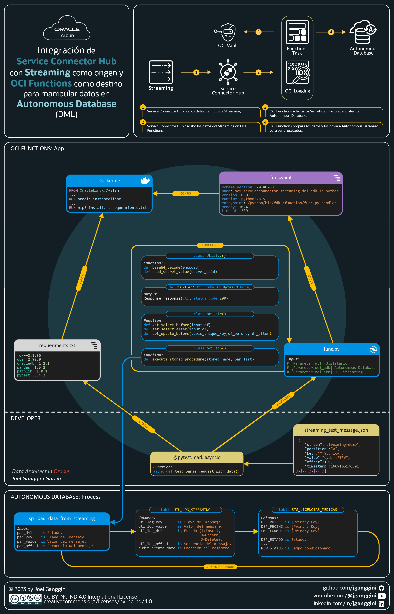
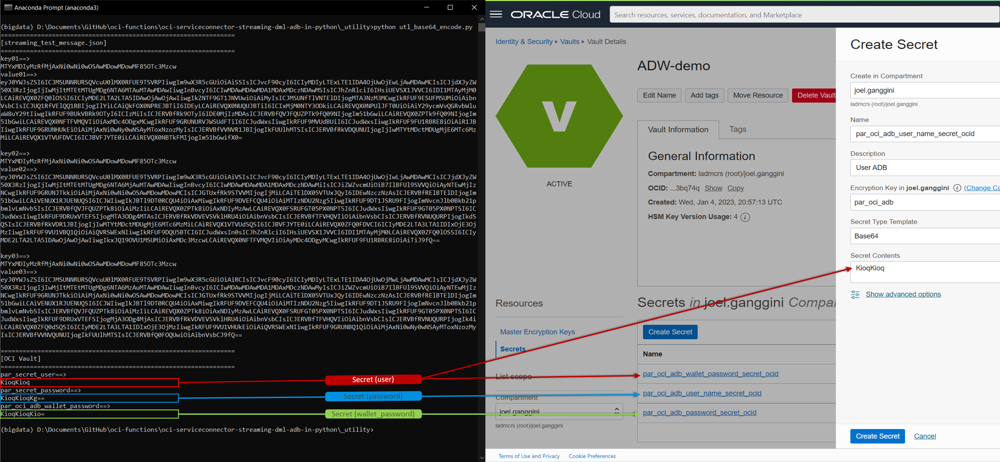

[![Issues][issues-shield]][issues-url]
[![LinkedIn][linkedin-shield]][linkedin-url]


<!-- PROJECT LOGO -->
<br />
<p align="center">
  

  <h2 align="center">OCI Functions</h3>

  <p align="center">
    Integración de Service Connector Hub con Streaming como origen y <br />
    OCI Functions como destino para manipular datos en Autonomous Database (DML)
    <br />
    <a href="func.py"><strong>Explore the code »</strong></a>
    <br />
    <br />
    <a href="https://youtu.be/prc_qrCHIQA">🎬 View Demo</a>
    ·
    <a href="https://github.com/jganggini/oci-functions/issues">Report Bug</a>
    ·
    <a href="https://github.com/jganggini/oci-functions/pulls">Request Feature</a>
  </p>
</p>


<!-- TABLE OF CONTENTS -->
<details open="open">
  <summary>Contenido</summary>
  <ol>
    <li><a href="#caso-de-uso">Caso de Uso</a></li>
    <li>
        <a href="#descripción">Descripción</a>
        <ul>
            <li><a href="#config">Config</a></li>
            <li><a href="#parameters">Parameters</a></li>
        </ul>
    </li>
    <li><a href="#instalación">Instalación</a></li>
    <li><a href="#ejecución-local">Ejecución Local</a></li>
    <li><a href="#Publicación-en-oci">Publicación en OCI</a></li>
    <li><a href="#ejecución-en-oci">Ejecución en OCI</a></li>
    <li><a href="#referencias">Referencias</a></li>
    <li><a href="#contacto">Contacto</a></li>
  </ol>
</details>

<!-- Caso de Uso -->
## Caso de Uso

El siguiente proyecto cubre la necesidad de migrar y transformar los datos en línea. 
Actualmente se cuenta con una aplicación que cuenta con una base de datos Oracle (On-Premise) como repositorio de datos transaccionales. Algunos datos de la aplicación se deben de integrar en línea con otro conjunto de datos de otra base de datos sin afectar el performance de la aplicación.
que cuenta con tablas transaccionales los datos son enviados por Golden Gate a OCI Streaming para que los mensajes enviados puedan ser modificados (DML) y posteriormente enviados a Autonomous Database por medio de OCI Functions gracias a la integración de Services Conector Hub ideal para describir, ejecutar y supervisar interacciones al mover datos entre servicios de Oracle Cloud Infrastructure.

<strong>Servicios de OCI:</strong>
* OCI Streaming (`Envía los mensajes en formato JSON con las entidades [Key], [Value], [offset] entre otros.`)
* OCI Functions (`Recibe los mensajes para detectar los cambios realizados por la variable "op_type" que puede tener los estados de Insert=I, Update=U, Delete=D`)
* OCI Vault (`Se almacenan las credenciales de ADB (User/Password) en Secrets cifrados en base64.`)
* OCI Looging (`Integra OCI Funtions con Logging para el seguimiento del log de las ejecuciones.`)
* Service Connector Hub (`Integra los servicios de Streaming con el de Functions para poder lograr la sincronización por eventos.`)
* Autonomous Database (`Recibe los mensajes y realiza tareas de transformaciones por medio de un Stored Procedure`)

<!-- Descripción -->
## Descripción

<strong>El siguiente diagrama ilustra esta arquitectura de referencia:</strong>

<p align="center">
    
</p>

<!-- Config -->
## Config

Los SDK y la CLI de Oracle Cloud Infrastructure requieren información de configuración básica, como las credenciales de usuario y el OCID de arrendamiento. [SDK and CLI Configuration File](https://docs.oracle.com/en-us/iaas/Content/API/Concepts/sdkconfig.htm)

<!-- Parameters -->
## Parameters

* <u>Config:</u></br>
  Agregamos los siguientes parámetros de la aplicación:

  ```python
  # [Parameter:utl] Utility
  utl_path                                = str(pathlib.Path(__file__).parent.absolute())
  # [Parameter:oci]
  par_oci_config                          = oci.config.from_file(utl_path + '/_oci/config')
  ```

  * Descargamos el `API Key` de OCI y lo colocamos en la carpeta `.\_oci\..`:
    * oracleidentitycloudservice_joel.ganggini-01-05-00-14.pem
    * config
                    
  * Para ello ingresamos a nuestra cuenta de `OCI` e ingresamos a nuestro `perfil`:
    <p align="center">
      
    </p>
    
  * Creamos el archivo confg con el perfil `[DEFAULT]`: 

    ```python
    [DEFAULT]
    user=ocid1.user.oc1..**********************
    fingerprint=94:75:f2:54:c0:3f:60:e6:23:2a:ce:e9:95:0a:a2:68
    tenancy=ocid1.tenancy.oc1..**********************
    region=us-ashburn-1
    key_file=./_oci/oracleidentitycloudservice_joel.ganggini-01-05-00-14.pem
    ```

* <u>Autonomous Database:</u></br>
  Agregamos los siguientes parámetros de la aplicación:

  ```python
  # [Parameter:oci_adb] Autonomous Database
  par_oci_adb_user_name_secret_ocid       = Utility.read_secret_value('ocid1.vaultsecret.oc1.iad.***')
  par_oci_adb_password_secret_ocid        = Utility.read_secret_value('ocid1.vaultsecret.oc1.iad..***')
  par_oci_adb_wallet_password_secret_ocid = Utility.read_secret_value('ocid1.vaultsecret.oc1.iad..***')
  ```

  * Descargamos el Wallet de OCI y lo colocamos en la carpeta `.\_oci\adb_wallet\..`:
    * cwallet.sso
    * ewallet.p12
    * ewallet.pem
    * keystore.jks
    * ojdbc.properties
    * README
    * sqlnet.ora
    * tnsnames.ora
    * truststore.jks
                    
  * Para ello ingresamos a nuestra cuenta de `OCI` e ingresamos a `Autonomous Database`:
    <p align="center">
      
    </p>

* <u>OCI Vault:</u></br>

  * Codificamos en `base64` los accesos de `Autonomous Database`:
    * user_name
    * passowrd
    * wallet password

  * Para ello ejecutamos el utilitario `.\_utility\utl_base64_encode.py`:
    <p align="center">
      
    </p>

  * Luego ingresamos a `OCI` e ingresamos los resultados en los `Secrets` de `OCI Vault`:
    <p align="center">
      
    </p>

* <u>OCI Streaming (Message Demo):</u></br>

  * Creamos un archivo `json` que sera invocado por `pytest` para las pruebas unitarias, con la siguiente estructura:
    ```json
    [{
        "stream":"streaming-demo",
        "partition":"0",
        "key":"MTY...",
        "value":"eyJ...", //<--op_type='I'
        "offset":101,
        "timestamp":1669165176691
    },{
        "stream":"streaming-demo",
        "partition":"0",
        "key":"MTY...",
        "value":"eyJ...", //<--op_type='U'
        "offset":102,
        "timestamp":1669165176692
    },{
        "stream":"streaming-demo",
        "partition":"0",
        "key":"MTY...",
        "value":"eyJ...", //<--op_type='D'
        "offset":103,
        "timestamp":1669165176693
    }]
    ```
  * Codificamos en `base64` el valor de las siguientes columnas para simular el envio de `OCI Streaming` a nuestro función:
    * key
    * value

  * Para ello ejecutamos el utilitario `.\_utility\utl_base64_encode.py`:
    <p align="center">
      
    </p>

<!-- Instalación -->
## Instalación

*   Utilice el administrador de paquetes [pip](https://pip.pypa.io/en/stable/) para instalar las siguientes librerias:

    ```bash
    pip install fdk --user
    pip install oci --user
    pip install oracledb --user
    pip install pandas --user
    pip install pathlib --user
    pip install pytest --user
    ```

<!-- Ejecución Local-->
## Ejecución Local

* `CMD`: Probamos nuestro código en local mediante `pytes`:
  ```cmd
  python -m pytest -v -s --tb=long func.py
  ```

* `CMD`: Esperamos que termine de ejecutar la aplicación.
  <p align="center">
    
  </p>

* Se ingresan 3 registros en la tabla `utl_log_streaming` en Autonomous Database que representan las acciones enviadas (I/U/D) al stored procedure `sp_load_data_from_streaming`:
  <p align="center">
    
  </p>

* Se inserta, actualiza y elimina el registro en la tabla `stg_licencias_medicas` en Autonomous Database por ello la tabla debera encontarse vacia. 

<!-- Publicación en OCI -->
## Publicación en OCI

* Ingresamos a `OCI` y seguimos los siguientes Pasos:
  <p align="center">
    
  </p

  * `Step 01:` Ingresamos a `OCI Functions`
  * `Step 02:` Creamos la aplicacion `app-streaming`
  * `Step 03:` Empezamos ejecutando los pasos del `1` al `7`. [Functions QuickStart on Cloud Shell - Oracle](https://docs.public.oneportal.content.oci.oraclecloud.com/en-us/iaas/Content/Functions/Tasks/functionsquickstartcloudshell.htm#functionsquickstart_cloudshell).
  * `Step 04:` Seleccionamos `Functions` y creamos una función en `Code Editor`. [Creación de funciones en Code Editor - Oracle](https://docs.oracle.com/es-ww/iaas/Content/Functions/Tasks/functionscreatingfunctions-usingcodeeditor.htm).
  * `Step 05:` Creamos un nuevo folder `oci-serviceconnector-streaming-dml-adb-in-python`.
  * `Step 06:` Abrimos el Workspace creado anteriormente.
  * `Step 07:` Pasamos nuestro codigo y abrimos el terminal seleccionando `func.py`.
  * `Step 08:` Desplegamos nuestra funcion en `app-streaming`.
    * Comentamos las ultimos lineas de `func.py` referentes a `pytest`.      
      ```python
      '''
      ############[pytest]############
      @pytest.mark.asyncio
      async def test_parse_request_with_data():
          # Produce Test Message
          with open("streaming_test_message.json", "rb") as fh:
              data = io.BytesIO(fh.read())
          
          call = await fixtures.setup_fn_call(handler, content=data)

          content, status, headers = await call

          assert 200 == status
          # python -m pytest -v -s --tb=long func.py
          # fn -v deploy --app app-streaming
          # fn invoke app-streaming oci-serviceconnector-streaming-dml-adb-in-python
      '''
      ```
    * Ejecutamos el siguiente comando en el terminal para desplegar la aplicación.
      ```cmd
      fn -v deploy --app app-streaming
      ```
  * `Step 09:` Vemos nuestra funcion desplegada en `app-streaming`.

<!-- Ejecución Dataflow -->
## Ejecución en OCI Data Flow

* Ingresamos a `OCI` y seguimos los siguientes Pasos:

  * Descomentamos las ultimos lineas de `func.py` referentes a `pytest` para usar el archivo json `streaming_test_message.json`.
    ```python
    ############[pytest]############
    @pytest.mark.asyncio
    async def test_parse_request_with_data():
        # Produce Test Message
        with open("streaming_test_message.json", "rb") as fh:
            data = io.BytesIO(fh.read())
        
        call = await fixtures.setup_fn_call(handler, content=data)

        content, status, headers = await call

        assert 200 == status
        # python -m pytest -v -s --tb=long func.py
        # fn -v deploy --app app-streaming
        # fn invoke app-streaming oci-serviceconnector-streaming-dml-adb-in-python
    ```
  * Ejecutamos el siguiente comando en el terminal para invocar la aplicación.
    ```cmd
    fn invoke app-streaming oci-serviceconnector-streaming-dml-adb-in-python
    ``` 

<!-- Referencias -->
## Referencias

*   [Oracle Cloud Infrastructure Documentation: SDK and CLI Configuration File:](https://docs.oracle.com/en-us/iaas/Content/API/Concepts/sdkconfig.htm)


* [Funciones QuickStart en Cloud Shell](https://docs.oracle.com/es-ww/iaas/Content/Functions/Tasks/functionsquickstartcloudshell.htm)
* [Visión general de OCI Service Connector Hub](https://docs.oracle.com/es-ww/iaas/Content/service-connector-hub/overview.htm)
* [Function development kit for Python](https://github.com/fnproject/fdk-python)
* [Visión general de OCI Functions](https://docs.oracle.com/es-ww/iaas/Content/Functions/Concepts/functionsoverview.htm)
* [Instalación de la CLI de Fn Project](https://docs.oracle.com/es-ww/iaas/Content/Functions/Tasks/functionsinstallfncli.htm)
* [Dockerfile - Imágenes base de FDK y Linux](https://docs.oracle.com/en-us/iaas/Content/Functions/Tasks/functionsfdksandlinuxdistros_faqs.htm)

<!-- Contacto -->
## Contacto

Joel Ganggini García - [@jganggini](https://www.linkedin.com/in/jganggini/) - jganggini@gmail.com<br/>
Project Link: [https://github.com/jganggini](https://github.com/jganggini)

<!-- MARKDOWN LINKS & IMAGES -->
<!-- https://www.markdownguide.org/basic-syntax/#reference-style-links -->
[issues-shield]: https://img.shields.io/github/issues/othneildrew/Best-README-Template.svg?style=for-the-badge
[issues-url]: https://github.com/jganggini/oci-functions/issues
[linkedin-shield]: https://img.shields.io/badge/-LinkedIn-black.svg?style=for-the-badge&logo=linkedin&colorB=555
[linkedin-url]: https://www.linkedin.com/in/jganggini/